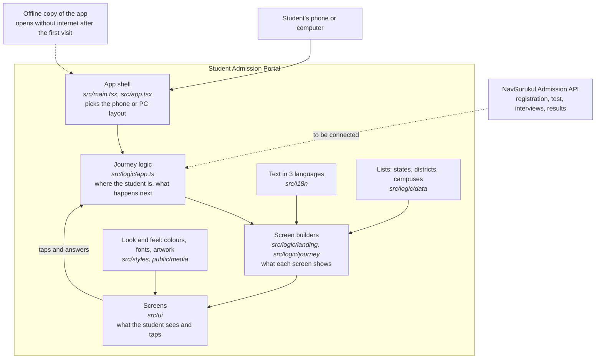

# NavGurukul Student Admission Portal

The app students use to apply to NavGurukul: learn about the programme, register, take the screening test, book
and attend two interviews, and receive their offer. It is built for phones first and works in English, Hindi and
Marathi.

## Run it

```bash
npm install
npm run dev        # open http://localhost:5173
npm run build      # production build in dist/
```

## Architecture


